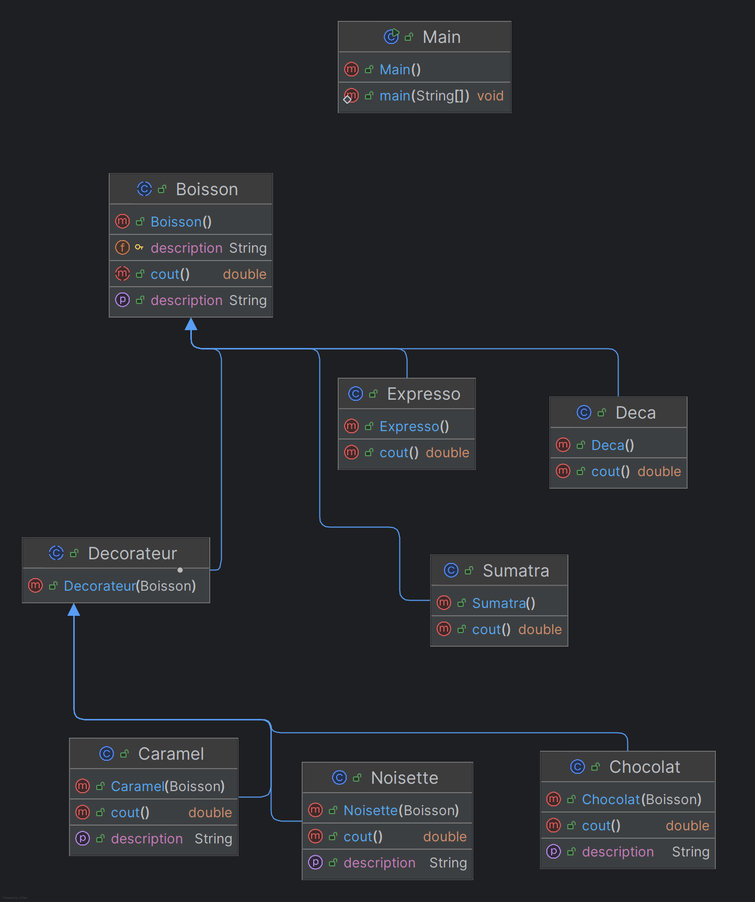

# ☕ Pattern Décorateur — Documentation 

## 📌 1. Introduction

Le **Pattern Décorateur** permet d’ajouter **dynamiquement** des responsabilités ou des fonctionnalités supplémentaires à un objet, *sans modifier son code source*.

Il constitue une alternative flexible à l’héritage, car il permet de combiner des décorations de manière dynamique et illimitée.

---

## 📌 2. Principe du pattern

Dans ce modèle :

### ✔ **Composant (Boisson)**

* Classe abstraite ou interface.
* Contient une description + un coût.

### ✔ **Composants Concrets**

Exemples :

* `Expresso`
* `Sumatra`
* `Deca`

### ✔ **Décorateur (CondimentDecorator)**

* Hérite de `Boisson`.
* Contient **une référence vers une autre Boisson**.
* Ajoute une fonctionnalité (ex. : chocolat, caramel…).

### ✔ **Décorateurs Concrets**

* `Chocolat`
* `Caramel`
* (autres décorations possibles)

Tu peux empiler les décorateurs autant que tu veux :

```
Boisson → Chocolat → Caramel → Caramel → ...
```

Chaque décorateur ajoute :

* une augmentation au coût,
* un texte supplémentaire à la description.

---

## 📌 3. Diagramme UML

Voici ton image intégrée :



---

## 📌 4. Exemple d’utilisation

### ▶ Test

```java
Boisson boisson;
boisson = new Sumatra();
System.out.println(boisson.getDescription());
System.out.println((boisson.cout()));

boisson = new Expresso();
System.out.println(boisson.getDescription());
System.out.println((boisson.cout()));

System.out.println("***************");

boisson = new Deca();
System.out.println(boisson.getDescription());
System.out.println((boisson.cout()));

System.out.println("***************");

boisson = new Chocolat(boisson);
System.out.println(boisson.getDescription());
System.out.println((boisson.cout()));

System.out.println("***************");

boisson = new Chocolat(new Sumatra());
System.out.println(boisson.getDescription());
System.out.println((boisson.cout()));

System.out.println("********b2*******");

Boisson boisson2;
boisson2 = new Sumatra();
System.out.println(boisson2.getDescription());
System.out.println((boisson2.cout()));

boisson2 = new Chocolat(boisson2);
System.out.println(boisson2.getDescription());
System.out.println((boisson2.cout()));

boisson2 = new Caramel(boisson2);
System.out.println(boisson2.getDescription());
System.out.println((boisson2.cout()));

boisson2 = new Caramel(boisson2);
System.out.println(boisson2.getDescription());
System.out.println((boisson2.cout()));
```

---

## 📌 5. Résultat obtenu

```
Sumatra
6.0
Expresso
12.0
***************
Deca
8.0
***************
Deca Au chocolat
9.2
***************
Sumatra Au chocolat
7.2
********b2*******
Sumatra
6.0
Sumatra Au chocolat
7.2
Sumatra Au chocolat Au Caramel
9.2
Sumatra Au chocolat Au Caramel Au Caramel
11.2

Process finished with exit code 0
```

---

## 📌 6. Conclusion

Le **Pattern Décorateur** permet une extension dynamique des objets avec :

* ✔ Ajout flexible de fonctionnalités
* ✔ Combinaison illimitée de décorateurs
* ✔ Respect du principe OCP (Open/Closed Principle)
* ✔ Alternative élégante à l’héritage multiple

Il est très utilisé dans la construction de boissons (comme ici), les systèmes graphiques, les flux d’entrée/sortie (Java I/O), et tout système nécessitant des options empilables.
