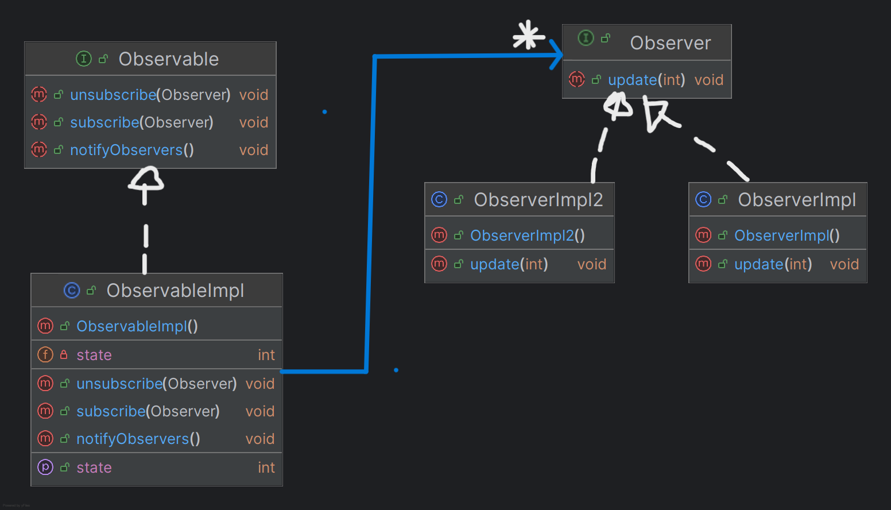

# 👁️ Pattern Observer — Documentation complète

## 📌 1. Introduction

Le **Pattern Observer** définit une relation **un-à-plusieurs** entre objets : lorsqu’un objet (appelé *Observable*) change d’état, tous les objets qui en dépendent (appelés *Observers*) sont automatiquement **notifiés** et **mis à jour**.

Ce pattern est très utilisé dans :

* les systèmes d’événements,
* les interfaces graphiques,
* les flux de données en temps réel.

Il permet de découpler fortement les composants.

---

## 📌 2. Principe du pattern

Le Pattern Observer repose sur deux rôles :

### ✔ **Observable (Sujet)**

* Stocke un *état*.
* Maintient une liste d’observers.
* Notifie tous les observers lorsqu’un changement se produit.

### ✔ **Observer**

* S’enregistre auprès de l’Observable.
* Réagit automatiquement lorsqu’il est notifié (méthode `update()`).

Ce découplage permet :

* d’ajouter/retirer des observers à tout moment,
* de modifier le comportement sans changer le code de l’Observable,
* de gérer plusieurs observers ayant chacun une logique différente.

---

## 📌 3. Diagramme UML (Pattern Observer)




---

## 📌 4. Exemple d’utilisation

### ▶ Test

```java
ObservableImpl observable = new ObservableImpl();

Observer o1 = new ObserverImpl2();
Observer o2 = new ObserverImpl();

observable.subscribe(o1);
observable.subscribe(o2);

observable.setState(60);
observable.setState(40);

observable.unsubscribe(o2);

observable.setState(80);
```

---

## 📌 5. Résultat obtenu

```
ObserverImpl2: mise à jour -> nouvel état = 60
ObserverImpl: mise à jour -> nouvel état = 60
--------------------------------------------
ObserverImpl2: mise à jour -> nouvel état = 40
ObserverImpl: mise à jour -> nouvel état = 40
--------------------------------------------
ObserverImpl2: mise à jour -> nouvel état = 80
```

*(Note : L’ObserverImpl ne reçoit plus la dernière notification, car il a été désinscrit.)*

```
Process finished with exit code 0
```

---

## 📌 6. Conclusion

Le Pattern Observer offre :

* ✔ un système flexible de notification automatique
* ✔ une indépendance totale entre l’émetteur et les récepteurs
* ✔ la possibilité d’ajouter/retirer des observers à la volée
* ✔ un code évolutif et modulaire

C’est un des patterns fondamentaux pour les applications événementielles et les architectures réactives.
