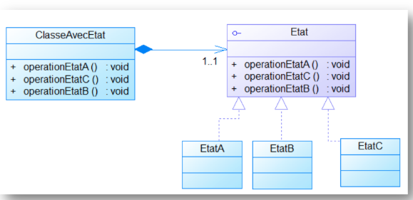

# 🔄 Pattern State — Documentation complète

## 📌 1. Introduction

Le **Pattern State** permet de **changer le comportement d’un objet** en fonction de son **état interne**.

Il est particulièrement utile pour :

* Isoler les **algorithmes spécifiques** à chaque état,
* Simplifier la gestion des **changements de comportement**,
* Rendre le code **plus lisible et maintenable** pour des objets à états multiples.

Exemple concret : un **avion** peut être dans un des trois états :

* Garage,
* Sur la piste,
* En l’air.

Le comportement des méthodes change selon l’état actuel de l’avion.

---

## 📌 2. Principe du pattern

Le Pattern State repose sur :

### ✔ **Context (Objet)**

* Contient une référence vers l’état courant,
* Délègue les appels aux méthodes à l’état courant.

### ✔ **State (État abstrait)**

* Définit les méthodes possibles (`entrerAuGarage()`, `sortirDuGarage()`, `decoller()`, `atterrir()`, `doActivity()`),
* Chaque état concret implémente ces méthodes selon sa logique.

### ✔ **Concrete States (États concrets)**

* Implémentent le comportement spécifique pour chaque état de l’objet,
* Peuvent changer l’état du contexte lorsque certaines méthodes sont appelées.

Exemple :

* `GarageState` → permet de sortir du garage mais interdit de décoller,
* `PisteState` → permet de décoller ou entrer au garage,
* `AirState` → permet d’atterrir mais interdit de retourner au garage directement.

---

## 📌 3. Diagramme UML (Pattern State)

> 
---

## 📌 4. Exemple d’utilisation

### ▶ Test

```java
public class Main {
    public static void main(String[] args) {
        Avion avion = new AvionImp();

        avion.doActivity();
        avion.entrerAuGarage();
        avion.doActivity();
        avion.atterir();
        avion.sortirDuGarage();
        avion.decoller();
        avion.atterir();
        avion.entrerAuGarage();
        avion.doActivity();
        avion.decoller();
        avion.atterir();
    }
}
```

---

## 📌 5. Résultat obtenu

```
Activité de l'etat en piste ................. 
...
Transition d'etat de  En Piste => Garage
Activité de l'etat au garage  .................0
...
imposible d'atterir je suis au garage
Transition d'etat de  Garage => Piste
Transition d'etat de  En Piste => decollage
Transition d'etat de  en l'air => Piste
Transition d'etat de  En Piste => Garage
...
imposible de decoller  je suis au garage
imposible d'atterir je suis au garage

Process finished with exit code 0
```

*(Chaque état contrôle quelles actions sont autorisées et assure les transitions appropriées, générant des erreurs si l’action est interdite.)*

---

## 📌 6. Conclusion

Le Pattern State offre :

* ✔ un **changement dynamique de comportement** selon l’état interne,
* ✔ une **isolation des algorithmes** propres à chaque état,
* ✔ un code plus **propre, maintenable et évolutif**,
* ✔ une gestion claire des transitions d’état complexes.

C’est un pattern idéal pour les systèmes où les objets ont des **comportements dépendants de leur état**, comme des machines, des jeux ou des applications embarquées.
