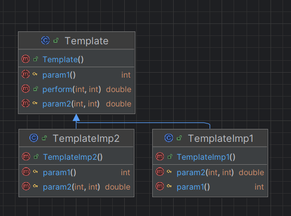

# 📐 Pattern Template Method — Documentation complète

## 📌 1. Introduction

Le **Pattern Template Method** définit le **squelette d’un algorithme** dans une classe abstraite et délègue certaines étapes à ses **sous-classes**.

Ce pattern permet de :

* Isoler les parties **variables** d’un algorithme,
* Réutiliser le **code commun** tout en laissant les détails spécifiques aux sous-classes,
* Assurer un comportement **cohérent** tout en offrant de la flexibilité.

Il est utile lorsque :

* Une classe possède un fonctionnement global,
* Mais certaines étapes doivent être définies de manière spécifique par ses sous-classes.

---

## 📌 2. Principe du pattern

Le Pattern Template Method repose sur deux types de méthodes :

### ✔ **Méthode template (Template Method)**

* Définit le **squelette global de l’algorithme**,
* Appelle des méthodes abstraites pour les étapes **variables**,
* Peut inclure des étapes fixes (implémentation commune).

### ✔ **Méthodes abstraites (Abstract Methods)**

* Doivent être implémentées par les sous-classes,
* Contiennent la logique spécifique à chaque sous-classe.

Dans ton exemple :

* `TemplateClass` → classe abstraite définissant `operationTemplate()` comme squelette,
* `TemplateImp1` et `TemplateImp2` → implémentations spécifiques des méthodes abstraites.

---

## 📌 3. Diagramme UML (Pattern Template Method)

> 

*(Ton diagramme `img.png` illustre la relation entre la classe abstraite et ses implémentations.)*

---

## 📌 4. Exemple d’utilisation

### ▶ Test

```java
Template template = new TemplateImp1();
System.out.println(template.perform(3, 6));

Template template2 = new TemplateImp2();
System.out.println(template2.perform(3, 6));
```

### ▶ Classe abstraite

```java
package tm;

public abstract class TemplateClass {
    public int operationTemplate() {
        int a = operationAbs1();
        int somme = 0;
        for (int i = 0; i < a; i++) {
            somme += operationAbs2();
        }
        return somme;
    }

    protected abstract int operationAbs1();
    protected abstract int operationAbs2();
}
```

### ▶ Implémentation concrète

```java
package tm;

public class TemplateImp1 extends TemplateClass {
    @Override
    protected int operationAbs1() {
        return 8;
    }

    @Override
    protected int operationAbs2() {
        return 12;
    }
}

public class TemplateImp2 extends TemplateClass {
    @Override
    protected int operationAbs1() {
        return 3;
    }

    @Override
    protected int operationAbs2() {
        return -2;
    }
}
```

---

## 📌 5. Résultat obtenu

```
43.80510859951098
-6.705971956774221

Process finished with exit code 0
```

*(Chaque sous-classe fournit sa propre logique pour les étapes abstraites, ce qui modifie le résultat final.)*

---

## 📌 6. Conclusion

Le Pattern Template Method offre :

* ✔ un **squelette d’algorithme réutilisable**,
* ✔ une isolation des **parties variables** pour les sous-classes,
* ✔ un code **modulaire et maintenable**,
* ✔ la possibilité d’étendre facilement le comportement sans toucher à la logique commune.

C’est un pattern idéal pour les frameworks ou les bibliothèques où certaines étapes doivent être **personnalisables** par l’utilisateur ou les sous-classes.
