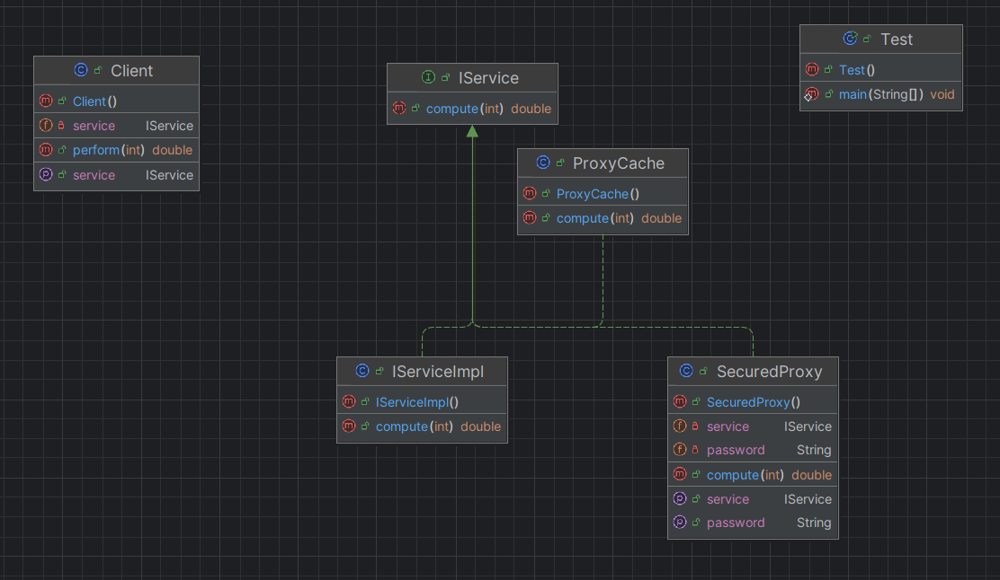

# 🛡️ Pattern Proxy — Documentation 

## 📌 1. Introduction

Le **Pattern Proxy** fournit un **intermédiaire** entre la partie cliente et un objet réel, permettant de **contrôler l’accès** à ce dernier.

Il est souvent utilisé pour :

* Gérer le **caching** (mise en cache des résultats),
* Contrôler les **accès sécurisés**,
* Retarder l’instanciation d’objets lourds (**Lazy Initialization**),
* Logger ou surveiller les appels à un service.

Le client interagit uniquement avec le proxy, qui décide de **déléguer ou non** l’appel à l’objet réel.

---

## 📌 2. Principe du pattern

Le Pattern Proxy repose sur trois éléments principaux :

### ✔ **Sujet (Interface commune)**

* Définit les méthodes accessibles au client (`IService` dans ton exemple).

### ✔ **Objet réel (Real Subject)**

* Contient la logique métier réelle (`IServiceImpl`).

### ✔ **Proxy**

* Implémente la même interface que l’objet réel.
* Contrôle l’accès à l’objet réel : cache les résultats, ajoute de la sécurité ou effectue des optimisations.

Exemples dans ton code :

* `ProxyCache` → met en cache les résultats pour éviter des recalculs coûteux.
* `SecuredProxy` → exige un mot de passe avant d’exécuter la méthode.

---

## 📌 3. Diagramme UML (Pattern Proxy)

> 

*(Ton diagramme `img.png` montre l’interaction entre Client, Proxy et RealSubject)*

---

## 📌 4. Exemple d’utilisation

### ▶ Test

```java
IService service = new IServiceImpl();
Client client = new Client();

// Utilisation directe
client.setService(service);
System.out.println("RES=" + client.perform(23));
System.out.println("RES=" + client.perform(23));

// Utilisation du ProxyCache
System.out.println("---------------------ProxyCache-----------------");
IService cache = new ProxyCache();
client.setService(cache);
System.out.println("RES=" + client.perform(23));
System.out.println("RES=" + client.perform(23));

// Utilisation du SecuredProxy
System.out.println("---------------------Security Proxy-----------------");
IService service1 = new IServiceImpl();
var securedProxy = new SecuredProxy();
securedProxy.setPassword("1234");
securedProxy.setService(service1);
client.setService(securedProxy);
System.out.println("RES=" + client.perform(23));
System.out.println("RES=" + client.perform(23));

// SecuredProxy avec cache
System.out.println("---------------------Security + Cache-----------------");
IService cache2 = new ProxyCache();
securedProxy.setPassword("1234");
securedProxy.setService(cache2);
client.setService(securedProxy);
System.out.println("RES=" + client.perform(23));
System.out.println("RES=" + client.perform(23));
```

---

## 📌 5. Résultat obtenu

```
IService.compute....
RES=0.9205048534524404
IService.compute....
RES=0.9205048534524404
---------------------ProxyCache-----------------
IService.compute....
RES=0.9205048534524404
RES=0.9205048534524404
---------------------Security Proxy-----------------
IService.compute....
RES=0.9205048534524404
IService.compute....
RES=0.9205048534524404
---------------------Security + Cache-----------------
IService.compute....
RES=0.9205048534524404
RES=0.9205048534524404

Process finished with exit code 0
```

*(Note : Le ProxyCache évite de recalculer le résultat pour la même entrée, tandis que SecuredProxy vérifie l’autorisation avant d’appeler le service.)*

---

## 📌 6. Conclusion

Le Pattern Proxy offre :

* ✔ un contrôle fin sur l’accès à un objet,
* ✔ des optimisations comme le **caching**,
* ✔ la possibilité d’ajouter de la sécurité ou du logging sans modifier le code de l’objet réel,
* ✔ un code modulaire et facilement extensible.

C’est un pattern très pratique pour gérer l’accès aux ressources critiques ou coûteuses, et pour enrichir un service existant de fonctionnalités transversales.
