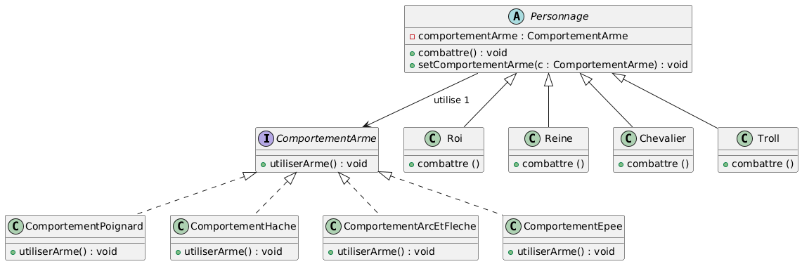

# 🧠 Pattern Strategy — Documentation 

## 📌 1.  Pattern Strategy

Le **Pattern Strategy** est un patron de conception comportemental qui permet de définir une **famille d’algorithmes**, de les encapsuler et de les rendre **interchangeables**.
Il permet aussi de faire évoluer chaque algorithme **indépendamment** des classes qui l'utilisent.

C’est un pattern idéal lorsqu’un objet doit changer de comportement **dynamiquement à l’exécution**, sans modifier son code interne.

---

## 📌 2. Principe du pattern

Un *Personnage* possède un comportement d’arme représenté par une interface :

* L’interface `ComportementArme` définit l’action `utiliserArme()`.
* Chaque type d’arme (Hache, Poignard, Arc…) implémente cette interface.
* Le personnage peut changer d’arme à tout moment via `setComportementArme()`.

Ainsi :

* le code est **ouvert à l’extension** (ajout de nouvelles armes),
* mais **fermé à la modification** (pas besoin de toucher aux classes existantes).

---

## 📌 3. Diagramme UML (Pattern Strategy)



---

## 📌 4. Exemple d’implémentation

### ▶ Test d’utilisation

```java
Personnage personnage = new Personnage();
personnage.setComportementArme(new ComportementArctEtFliche());
personnage.Combatrer();

System.out.println("******************************************");

Reine reine = new Reine();
reine.setComportementArme(new ComportementArctEtFliche());
reine.Combatrer();

System.out.println("******************************************");

Roi roi = new Roi();
roi.setComportementArme(new ComportementHache());
roi.Combatrer();

System.out.println("******************************************");

Chevalier chevalier = new Chevalier();
chevalier.setComportementArme(new ComportementPoignard());
chevalier.Combatrer();
```

---

## 📌 5. Résultat obtenu

```
le comportement arme utiliser est :
Comportement Arct et fliche
******************************************

- Reine
  le comportement arme utiliser est :
  Comportement Arct et fliche
******************************************

- Roi
  le comportement arme utiliser est :
  ComportementHache
******************************************

- Chevalier
  le comportement arme utiliser est :
  ComportementPoignard
```

```
Process finished with exit code 0
```

---

## 📌 6. Conclusion

Le Pattern Strategy permet :

* d’améliorer la flexibilité du code
* de rendre les comportements interchangeables
* de faciliter l’évolution du projet
* d’éviter les grosses structures conditionnelles (`if` / `switch`)

Il s’agit d’un des patterns les plus utilisés dans le développement orienté objet, car il sépare proprement **le comportement** de **l’objet qui l’utilise**.


