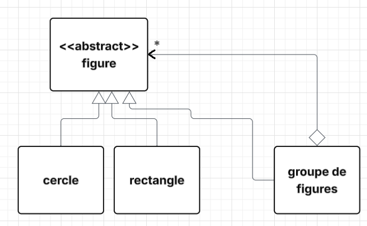
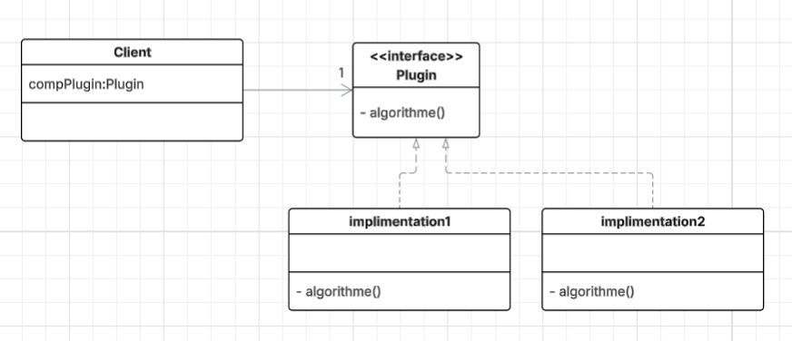
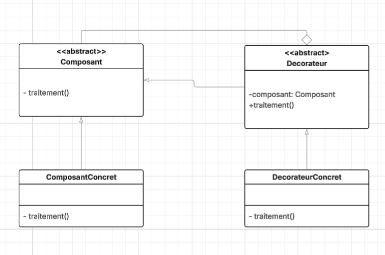
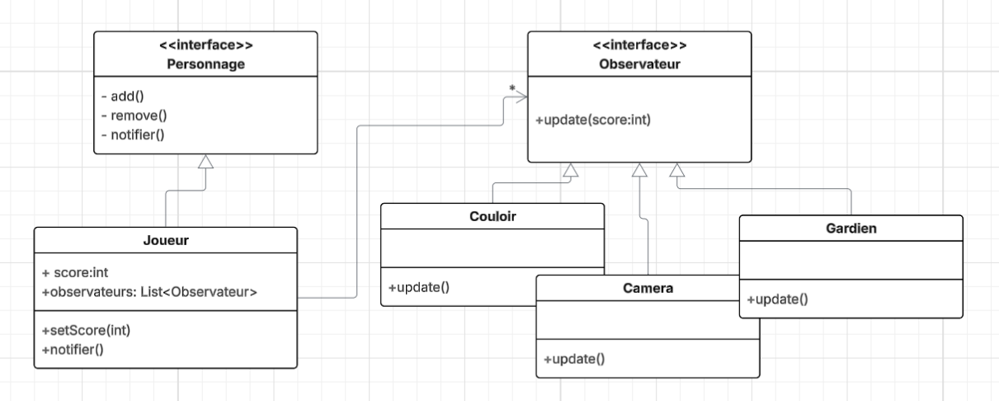
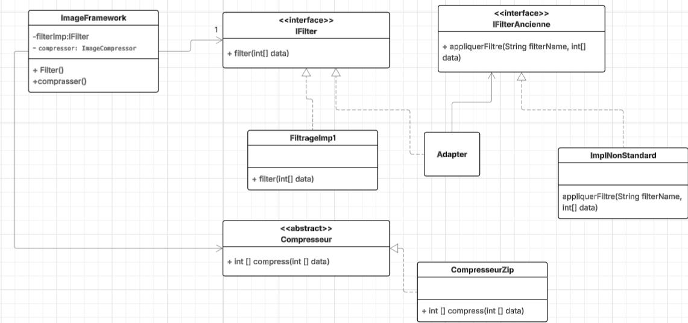

# Design Patterns

Ce projet présente plusieurs situations de conception orientée objet avec leurs **diagrammes de classes UML** et les **design patterns** appropriés.  
Chaque cas illustre un problème typique de conception et la solution par un pattern reconnu.

---

##  1. Figure (Cercle, Rectangle, Groupe de Figures)

### 🔹 **Pattern : Composite**

**Objectif :**  
Traiter de manière uniforme les objets simples (Cercle, Rectangle) et les objets composés (GroupeDeFigures).

### **Diagramme UML**

---

##  2. Plugin avec squelette d’algorithme

### 🔹 **Patterns : Strategy **

**Objectif :**  
Permettant à l’application cliente d’instancier dynamiquement le plugin concret.

### **Diagramme UML**

---

##  3. Ajouter des responsabilités sans modifier le code source

### 🔹 **Pattern : Decorator**

**Objectif :**  
Étendre les fonctionnalités d’un composant existant sans modifier son code, en l’enveloppant dans un décorateur.

### **Diagramme UML**

---

##  4. Notification des objets lorsque le score du joueur change

### 🔹 **Pattern : Observer**

**Objectif :**  
Informer automatiquement les objets observateurs (Caméra, Couloir, Gardien) lorsque l’état du joueur change, sans couplage fort.

### **Diagramme UML**

---
##  5. Framework de Traitement d’Images – Design Patterns (Strategy, Adapter, Template Method)

Ce projet consiste à concevoir et développer un **Framework extensible** permettant d’effectuer des **traitements sur une image** représentée par un tableau d'entiers (`int[] data`).  
Le Framework définit deux opérations principales :
- **Filtrage de l’image** : `public int[] filter(int[] data)`
- **Compression de l’image** : `public int[] compresser(int[] data)`
---

##  Design Patterns Utilisés

### 1️⃣ Strategy Pattern – pour le filtrage
Le pattern **Strategy** est utilisé pour permettre le changement dynamique de l’algorithme de filtrage.  
Ainsi, le Framework peut appliquer différentes stratégies de filtrage sans modifier son code source.

### 2️⃣ Adapter Pattern – compatibilité avec une ancienne implémentation

Une ancienne version de filtrage existe, avec une méthode incompatible :
Pour l’intégrer sans modifier le code existant, le pattern Adapter est appliqué.

### 3️⃣ Template Method Pattern – pour la compression

Le pattern Template Method est utilisé pour définir le squelette de l’algorithme de compression.
Les sous-classes définissent les étapes spécifiques de la compression.

