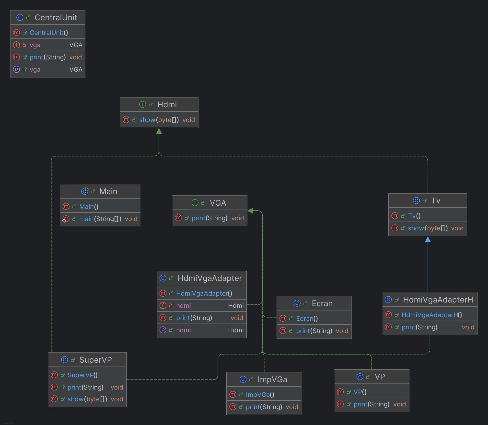

# 🔌 Pattern Adapter — Documentation 

## 📌 1. Introduction

Le **Pattern Adapter** permet de **convertir l’interface d’une classe** dans une interface compatible avec celle attendue par la partie cliente.

Il est très utile pour :

* Faire fonctionner ensemble des classes incompatibles,
* Réutiliser du code existant sans le modifier,
* Assurer la compatibilité entre anciens et nouveaux composants.

---

## 📌 2. Principe du pattern

Le Pattern Adapter peut être implémenté de deux manières :

### ✔ **Adapter par composition (Object Adapter)**

* L’adapter contient une instance de la classe existante (*adaptee*).
* Il traduit les appels de la partie cliente vers l’adaptee.

### ✔ **Adapter par héritage (Class Adapter)**

* L’adapter hérite de la classe existante (*adaptee*).
* Il implémente la nouvelle interface attendue par le client.

---

## 📌 3. Diagramme UML (Pattern Adapter)

---

## 📌 4. Exemple d’utilisation

### ▶ Test

```java
CentralUnit centralUnit = new CentralUnit();

// Utilisation directe
centralUnit.setVga(new Ecran());
centralUnit.print("hello Ecran");

centralUnit.setVga(new VP());
centralUnit.print("hello vp");

// Adapter par composition
HdmiVgaAdapter adapter = new HdmiVgaAdapter();
adapter.setHdmi(new Tv());
centralUnit.setVga(adapter);
centralUnit.print("hello");

// Adapter par héritage
HdmiVgaAdapterH adapterH = new HdmiVgaAdapterH();
centralUnit.setVga(adapterH);
centralUnit.print("hello heritage");

// SuperVP avec interface VGA
centralUnit.setVga(new SuperVP());
centralUnit.print("hello SuperVP");

// SuperVP avec adapter
HdmiVgaAdapter adapter2 = new HdmiVgaAdapter();
adapter2.setHdmi(new SuperVP());
centralUnit.setVga(adapter2);
centralUnit.print("hello SuperVP");
```

---

## 📌 5. Résultat obtenu

```
**********Central Unit****************
*********Ecran*****************
hello Ecran
************Ecran**************
***************Central Unit***********
**********Central Unit****************
*********VP avec VGA*****************
hello vp
***********VP vga***************
***************Central Unit***********
**********Central Unit****************
*************Adapter*************
Tv show
hello
Tv show
************ / Adapter**************
***************Central Unit***********
**********Central Unit****************
*************Adapter*************
Tv show
hello heritage
Tv show
************ / Adapter**************
***************Central Unit***********
**********Central Unit****************
************Super vp Vga**************
hello SuperVP
**************Super vp Vga***************
***************Central Unit***********
**********Central Unit****************
*************Adapter*************
*************Super vp Hdmi*************
hello SuperVP
**************Super vp Hdmi**************
************ / Adapter**************
***************Central Unit***********

Process finished with exit code 0
```

*(Note : Tous les types d’adapters fonctionnent avec la CentralUnit de façon transparente.)*

---

## 📌 6. Conclusion

Le Pattern Adapter offre :

* ✔ la compatibilité entre interfaces incompatibles,
* ✔ la possibilité de réutiliser du code existant,
* ✔ une solution flexible grâce à la composition ou l’héritage,
* ✔ un code plus modulable et évolutif.

C’est un pattern essentiel lorsqu’on travaille avec des bibliothèques externes ou du code existant qui ne correspond pas directement à l’interface attendue.
