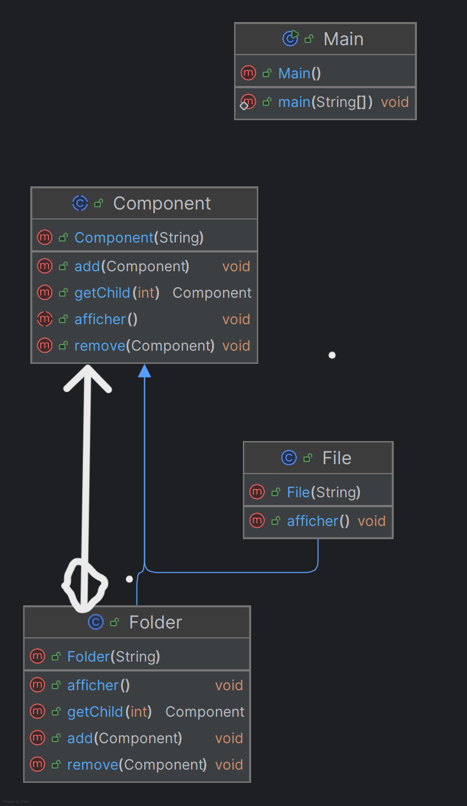

# 📦 Pattern Composite 

Le **Pattern Composite** permet d’organiser les objets sous forme **arborescente** (comme un système de fichiers) et d’offrir une interface uniforme pour manipuler :

* un **objet simple** (feuille)
* un **objet composé** (contenant d’autres objets)

Ainsi, la partie cliente peut traiter un objet unique et un objet composé **de la même manière**, sans avoir à connaître leur nature.

---

## 🎯 Objectif

* Représenter une **hiérarchie arbre** (ex : fichiers/dossiers)
* Permettre à l’utilisateur d’appeler la même méthode (`afficher()`) sur :

    * un **File**
    * un **Folder** contenant d'autres éléments

---

## 🧩 Structure du Pattern

### **Component (interface / classe abstraite)**

* Déclare les opérations communes (ex : `afficher()`).

### **Leaf (File)**

* Représente un objet final (pas d’enfants).

### **Composite (Folder)**

* Contient une liste de composants (files ou folders).
* Implémente les opérations en déléguant aux enfants.

---

## 📌 Exemple d’implémentation (Java)

```java
// Component
public abstract class Element {
    protected String name;
    public Element(String name) { this.name = name; }
    public abstract void afficher(String indent);
}

// Leaf
public class File extends Element {
    public File(String name) { super(name); }

    @Override
    public void afficher(String indent) {
        System.out.println(indent + "- File : " + name);
    }
}

// Composite
import java.util.ArrayList;
import java.util.List;

public class Folder extends Element {
    private List<Element> elements = new ArrayList<>();

    public Folder(String name) { super(name); }

    public void add(Element e) {
        elements.add(e);
    }

    @Override
    public void afficher(String indent) {
        System.out.println(indent + "+ Folder : " + name);
        for (Element e : elements) {
            e.afficher(indent + "    ");
        }
    }
}
```

---

## ▶️ Exemple d’utilisation

```java
public class Main {
    public static void main(String[] args) {

        Folder root = new Folder("Root");

        File f1 = new File("document.txt");
        File f2 = new File("photo.png");

        Folder subFolder = new Folder("SubFolder");
        File f3 = new File("file3.pdf");

        subFolder.add(f3);

        root.add(f1);
        root.add(f2);
        root.add(subFolder);

        root.afficher("");
    }
}
```

---

## 📤 Résultat obtenu

```
+ Folder : Root
    - File : document.txt
    - File : photo.png
    + Folder : SubFolder
        - File : file3.pdf
```

---

## 🖼️ Diagramme du pattern

